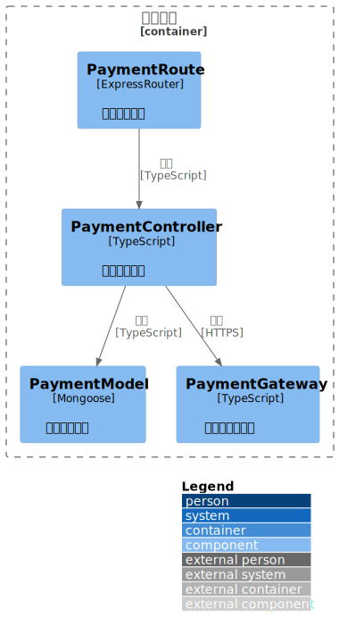
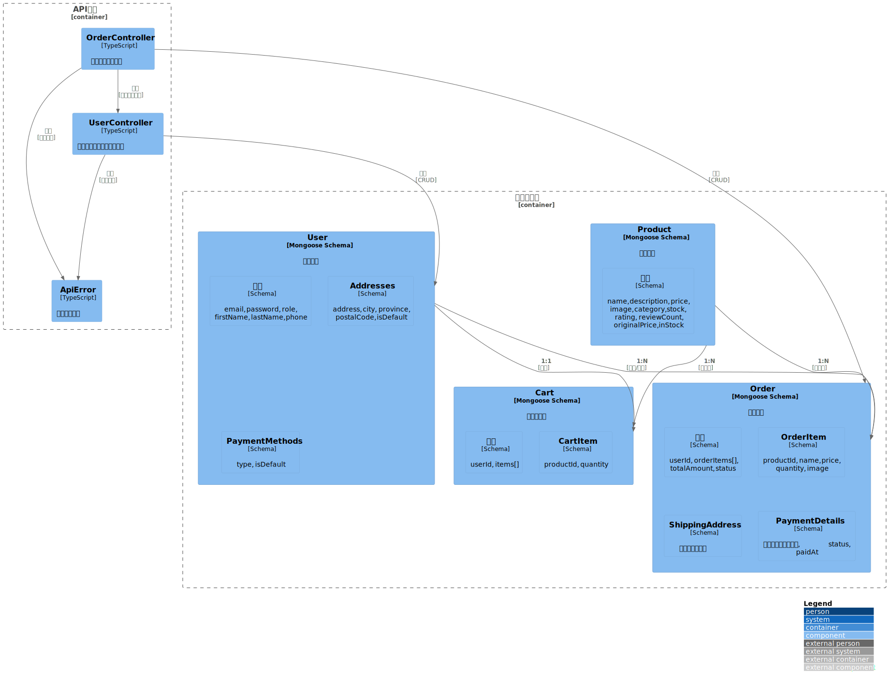

# 购物系统 Monorepo

基于 Turborepo 的购物系统 monorepo 项目，包含 Web 前端、移动应用和后端 API 服务。

## 项目结构

```
shopping-system/
├── apps/
│   ├── web/           # Next.js Web 前端应用
│   ├── mobile/        # Flutter 移动应用
│   └── api/           # Express.js 后端 API 服务
├── packages/
│   ├── ui/            # UI 组件库
│   └── shared/        # 共享工具和类型
├── docs/              # 项目文档
│   ├── api/           # API 文档
│   ├── architecture/ # 架构文档
│   ├── development/   # 开发文档
│   ├── operations/    # 运维文档
│   └── project/       # 项目文档
└── scripts/           # 工具脚本
```

## 使用技术

### 核心框架
- [Turborepo](https://turbo.build/repo) - Monorepo 构建系统
- [PNPM](https://pnpm.io/) - 包管理器
- [TypeScript](https://www.typescriptlang.org/) - 类型系统

### Web 前端
- [Next.js](https://nextjs.org/) - React 框架
- [React](https://react.dev/) - UI 库
- [Tailwind CSS](https://tailwindcss.com/) - CSS 框架
- [Radix UI](https://www.radix-ui.com/) - 无样式 UI 组件
- [Zustand](https://zustand-demo.pmnd.rs/) - 状态管理
- [React Hook Form](https://react-hook-form.com/) - 表单处理
- [i18next](https://www.i18next.com/) - 国际化
- [PostHog](https://posthog.com/) - 产品分析

### 移动应用
- [Flutter](https://flutter.dev/) - 跨平台移动应用框架
- [Dart](https://dart.dev/) - 编程语言
- [Provider](https://pub.dev/packages/provider) - 状态管理
- [Dio](https://pub.dev/packages/dio) - HTTP 客户端
- [Cached Network Image](https://pub.dev/packages/cached_network_image) - 图片缓存

### 后端 API
- [Express.js](https://expressjs.com/) - Node.js Web 框架
- [MongoDB](https://www.mongodb.com/) - 文档数据库
- [Mongoose](https://mongoosejs.com/) - MongoDB ODM
- [Serverless Framework](https://www.serverless.com/) - 无服务器部署
- [Swagger](https://swagger.io/) - API 文档

### 开发工具
- [Vitest](https://vitest.dev/) - 测试框架
- [Testing Library](https://testing-library.com/) - React 组件测试工具
- [Storybook](https://storybook.js.org/) - UI 组件开发环境
- [ESLint](https://eslint.org/) - 代码检查
- [Prettier](https://prettier.io/) - 代码格式化

### 部署与监控
- [Vercel](https://vercel.com/) - Web 应用部署平台
- [Vercel Analytics](https://vercel.com/docs/analytics) - 分析工具
- [Vercel Speed Insights](https://vercel.com/docs/speed-insights) - 性能监控

## 主要功能

### Web 前端功能

- 响应式设计，支持移动端和桌面端
- 商品分类浏览和搜索
- 购物车管理
- 用户注册、登录和账户管理
- 商品详情页
- 订单管理和历史记录
- 多语言支持（国际化）
- 深色模式支持
- 支付集成

### 移动应用功能

- 首页轮播图和推荐商品
- 商品分类浏览和筛选
- 购物车管理
- 用户账户管理
- 订单历史查看
- 本地数据缓存
- 响应式 UI 设计

### 后端 API 功能

- RESTful API 接口
- 用户认证和授权（JWT）
- 商品管理（CRUD 操作）
- 购物车管理
- 订单处理和状态管理
- 数据验证和错误处理
- Swagger API 文档
- 管理员权限控制

## 项目架构

### C4-Context


### C4-Container


### C4-Component


### C4-Code



## 数据库关系



## 配置说明

### Turborepo 配置

项目使用 Turborepo 进行构建管理，主要配置在 `turbo.json` 文件中：

```json
{
  "$schema": "https://turbo.build/schema.json",
  "globalDependencies": ["**/.env.*local"],
  "remoteCache": {
    "enabled": true
  },
  "pipeline": {
    "build": {
      "dependsOn": ["^build"],
      "outputs": ["dist/**", ".next/**", "!.next/cache/**"]
    },
    "lint": {},
    "dev": {
      "cache": false,
      "persistent": true
    },
    "clean": {
      "cache": false
    },
    "start": {
      "dependsOn": ["build"]
    },
    "test": {
      "dependsOn": ["^build"],
      "outputs": []
    }
  }
}
```

配置说明：

- `globalDependencies`: 全局依赖文件，环境变量文件变化会触发所有任务重新运行
- `remoteCache`: 启用 Turborepo 远程缓存功能
- `pipeline.build`: 构建命令，依赖于所有上游包的构建完成
- `pipeline.dev`: 开发命令，禁用缓存并设为持久运行
- `pipeline.clean`: 清理命令，禁用缓存
- `pipeline.start`: 启动命令，依赖于构建完成
- `pipeline.test`: 测试命令，依赖于构建完成

### GitHub Actions 配置

项目使用 GitHub Actions 进行 CI/CD，配置文件位于 `.github/workflows/ci.yml`。主要功能：

- 自动运行测试和构建
- 集成 Turborepo 远程缓存
- PNPM 依赖缓存优化

要启用 Turborepo 远程缓存，需要配置以下环境变量：

1. `TURBO_TOKEN`: 从 [Vercel 账户设置](https://vercel.com/account/tokens) 获取
2. `TURBO_TEAM`: 从 Vercel 团队设置中获取团队 ID

### Vercel 部署配置

项目使用 Vercel 进行部署，配置文件位于 `vercel.json`：

```json
{
  "$schema": "https://openapi.vercel.sh/vercel.json",
  "buildCommand": "pnpm build",
  "devCommand": "pnpm dev",
  "installCommand": "pnpm install",
  "framework": "nextjs"
}
```

## 开发指南

### 环境要求

#### 通用要求
- Node.js >= 18.0.0
- PNPM >= 8.0.0
- MongoDB >= 6.0

#### Web 前端
- Node.js >= 18.0.0
- PNPM >= 8.0.0

#### 移动应用
- Flutter SDK >= 3.8.0
- Dart SDK >= 3.8.0
- Android Studio / VS Code（推荐）
- iOS 开发需要 macOS 和 Xcode

#### 后端 API
- Node.js >= 18.0.0
- MongoDB >= 6.0
- AWS CLI（用于 Serverless 部署）

### 安装依赖

#### 安装所有依赖

```bash
pnpm install
```

#### 仅安装 Web 前端依赖

```bash
cd apps/web
pnpm install
```

#### 仅安装移动应用依赖

```bash
cd apps/mobile
flutter pub get
```

#### 仅安装后端 API 依赖

```bash
cd apps/api
pnpm install
```

### 开发模式

#### 启动所有服务

```bash
pnpm dev
```

#### 仅启动 Web 前端

```bash
cd apps/web
pnpm dev
# 访问 http://localhost:3000
```

#### 仅启动移动应用

```bash
cd apps/mobile
flutter run
# 或指定设备
flutter run -d chrome  # Web
flutter run -d ios     # iOS
flutter run -d android # Android
```

#### 仅启动后端 API

```bash
cd apps/api
pnpm dev
# 访问 http://localhost:3001
```

### 构建项目

#### 构建所有项目

```bash
pnpm build
```

#### 构建 Web 前端

```bash
cd apps/web
pnpm build
```

#### 构建移动应用

```bash
cd apps/mobile
flutter build apk        # Android APK
flutter build ios        # iOS
flutter build web        # Web
```

#### 构建后端 API

```bash
cd apps/api
pnpm build
```

### 运行测试

#### 运行所有测试

```bash
pnpm test
```

#### 运行 Web 前端测试

```bash
cd apps/web
pnpm test
pnpm test:watch      # 监听模式
pnpm test:coverage   # 覆盖率报告
```

#### 运行移动应用测试

```bash
cd apps/mobile
flutter test
flutter test --coverage  # 覆盖率报告
```

#### 运行后端 API 测试

```bash
cd apps/api
pnpm test
pnpm test:watch      # 监听模式
pnpm test:coverage   # 覆盖率报告
```

### 代码规范检查

#### 检查所有代码

```bash
pnpm lint
pnpm lint:fix        # 自动修复
pnpm format          # 格式化代码
```

#### 检查 Web 前端代码

```bash
cd apps/web
pnpm lint
```

#### 检查移动应用代码

```bash
cd apps/mobile
flutter analyze
```

#### 检查后端 API 代码

```bash
cd apps/api
pnpm lint
```

## 测试说明

项目使用 Vitest 和 Testing Library 进行测试：

- 组件测试：使用 Testing Library 进行 React 组件测试
- API 测试：使用 Vitest 进行后端 API 测试
- 集成测试：使用 Vitest 进行端到端测试

测试文件位于各包的 `tests` 目录下，遵循以下命名规范：

- 组件测试：`*.test.tsx`
- API 测试：`*.test.ts`
- 集成测试：`*.integration.test.ts`

## API 文档

项目提供完整的 OpenAPI 规范文档和 Postman 集合：

- [API 文档](docs/api/api-documentation.md)
- [OpenAPI 规范](docs/api/openapi.json)
- [Postman 集合](docs/api/postman_collection.json)

## 数据库初始化

后端 API 提供多种数据库种子脚本：

```bash
cd apps/api

# 使用200个商品数据初始化数据库（开发环境）
pnpm seed:products200:dev

# 使用200个商品数据初始化数据库（测试环境）
pnpm seed:products200:test

# 使用200个商品数据初始化数据库（生产环境）
pnpm seed:products200:prod
```

**注意**: 确保在运行种子脚本前已正确配置相应的环境变量文件（`.env.local`、`.env.test` 或 `.env.prod`）。

## 系统架构

项目架构文档和图表位于 `docs/architecture/` 目录：

### C4 模型
- [C4 Context 图](docs/architecture/c4-context.puml) - 系统上下文
- [C4 Container 图](docs/architecture/c4-container.puml) - 容器架构
- [C4 Component 图](docs/architecture/c4-component.puml) - 组件架构
- [C4 Code 图](docs/architecture/c4-code.puml) - 代码架构

### TOGAF 架构
- [业务架构](docs/architecture/togaf/business-architecture.puml)
- [应用架构](docs/architecture/togaf/application-architecture.puml)
- [数据架构](docs/architecture/togaf/data-architecture.puml)
- [技术架构](docs/architecture/togaf/technology-architecture.puml)

## 环境变量配置

### Web 前端环境变量

在 `apps/web` 目录下创建 `.env.local` 文件：

```env
# Next.js 配置
NEXTAUTH_SECRET=your_nextauth_secret_here
NEXTAUTH_URL=http://localhost:3000

# API 地址
NEXT_PUBLIC_API_URL=http://localhost:3001

# PostHog 分析（可选）
NEXT_PUBLIC_POSTHOG_KEY=your_posthog_key
NEXT_PUBLIC_POSTHOG_HOST=https://app.posthog.com
```

### 后端 API 环境变量

在 `apps/api` 目录下创建 `.env.local` 文件：

```env
# 数据库配置
MONGODB_URI=mongodb://localhost:27017/shopping-system-public

# 服务器配置
PORT=3001
NODE_ENV=development

# JWT 配置
JWT_SECRET=your_jwt_secret_here

# CORS 配置
CORS_ORIGINS=http://localhost:3000,http://localhost:8000

# 管理员配置
ADMIN_SECRET=your_admin_secret_here
```

### 移动应用环境变量

移动应用的环境变量通常在代码中配置，或通过构建时传入。详细配置请参考 [apps/mobile/README.md](apps/mobile/README.md)。

**注意**: 
- 所有敏感信息（如密钥、密码）不应提交到版本控制系统
- 生产环境应使用环境变量管理服务（如 Vercel、AWS Secrets Manager）
- 详细的环境变量说明请参考 [docs/development/ENVIRONMENT.md](docs/development/ENVIRONMENT.md)

## 项目访问链接

- **Web 应用**: https://felixzhu.shop
- **API 文档**: 访问后端 API 的 `/api-docs` 端点查看 Swagger 文档
- **移动应用**: 通过 Flutter 构建后安装到设备或使用模拟器运行

## 贡献指南

我们欢迎所有形式的贡献！请遵循以下步骤：

### 开发流程

1. **Fork 项目**到你的 GitHub 账户

2. **从保护分支创建新分支**
   ```bash
   git checkout master
   git pull origin master
   git checkout -b feat/your-feature-name
   ```

3. **进行开发**
   - 遵循项目代码规范
   - 编写必要的测试
   - 更新相关文档

4. **提交更改**
   ```bash
   git add .
   git commit -m "feat: add your feature description"
   ```
   - 提交信息请遵循 [提交规范](docs/development/COMMIT_CONVENTION.md)

5. **推送到分支**
   ```bash
   git push origin feat/your-feature-name
   ```

6. **创建 Pull Request**
   - 提交到 `feature` 分支（新特性）或 `master` 分支（其他改动）
   - 使用项目提供的 PR 模板
   - 确保所有 CI 检查通过
   - 等待 Code Review

### 分支命名规范

- `feat/xxx` - 新特性
- `fix/xxx` - Bug 修复
- `docs/xxx` - 文档更新
- `refactor/xxx` - 代码重构
- `style/xxx` - 样式修改
- `test/xxx` - 测试相关
- `chore/xxx` - 构建/工具相关

详细规范请参考项目根目录的 Git 规范文档。

### 代码规范

- 使用 ESLint 和 Prettier 保持代码风格一致
- 遵循 TypeScript 最佳实践
- 编写清晰的注释和文档
- 确保测试覆盖率

### 文档

- 更新相关 README 文件
- 更新 API 文档（如适用）
- 添加变更日志条目

更多信息请参考：
- [开发指南](docs/development/onboarding-guide.md)
- [测试指南](docs/development/testing-guide.md)
- [提交规范](docs/development/COMMIT_CONVENTION.md)

## 相关文档

### 开发文档
- [开发指南](docs/development/onboarding-guide.md) - 新成员入门指南
- [测试指南](docs/development/testing-guide.md) - 测试相关说明
- [提交规范](docs/development/COMMIT_CONVENTION.md) - Git 提交规范
- [版本管理](docs/development/VERSIONING.md) - 版本号管理规范
- [环境配置](docs/development/ENVIRONMENT.md) - 环境变量详细说明

### API 文档
- [API 文档](docs/api/api-documentation.md) - 完整的 API 说明
- [OpenAPI 规范](docs/api/openapi.json) - OpenAPI 3.0 规范文件
- [Postman 集合](docs/api/postman_collection.json) - Postman 测试集合

### 架构文档
- [架构概览](docs/architecture/) - 系统架构相关文档
- [C4 模型](docs/architecture/c4-model.puml) - 系统架构模型

### 运维文档
- [部署指南](docs/development/deployment-guide.md) - 部署相关说明
- [运维手册](docs/operations/operations-manual.md) - 运维操作手册
- [变更日志](docs/operations/change-log.md) - 版本变更记录

### 项目文档
- [文档概览](docs/project/documentation-overview.md) - 文档结构说明
- [术语表](docs/project/glossary.md) - 项目术语定义

## 许可证

MIT License

## 联系方式

如有问题或建议，请通过以下方式联系：

- 提交 [GitHub Issue](https://github.com/your-repo/issues)
- 创建 Pull Request
- 查看项目文档获取更多信息

