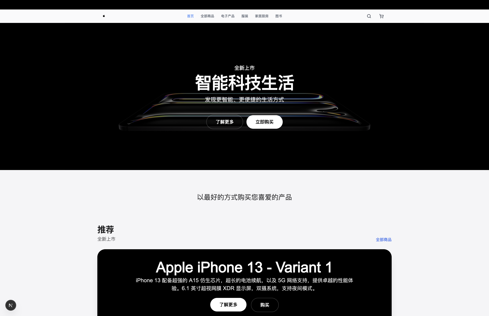
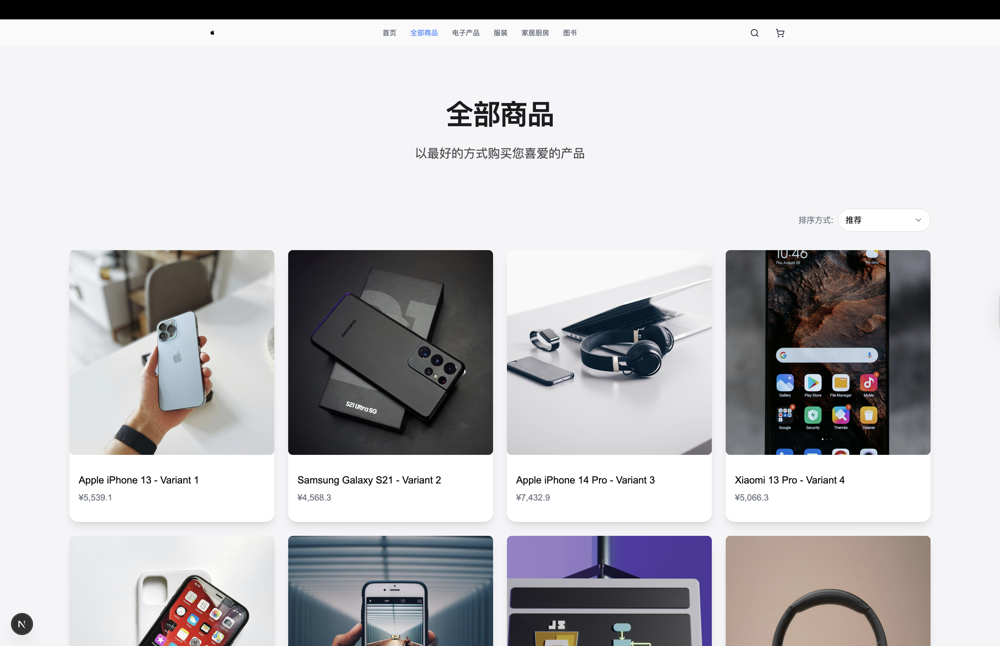
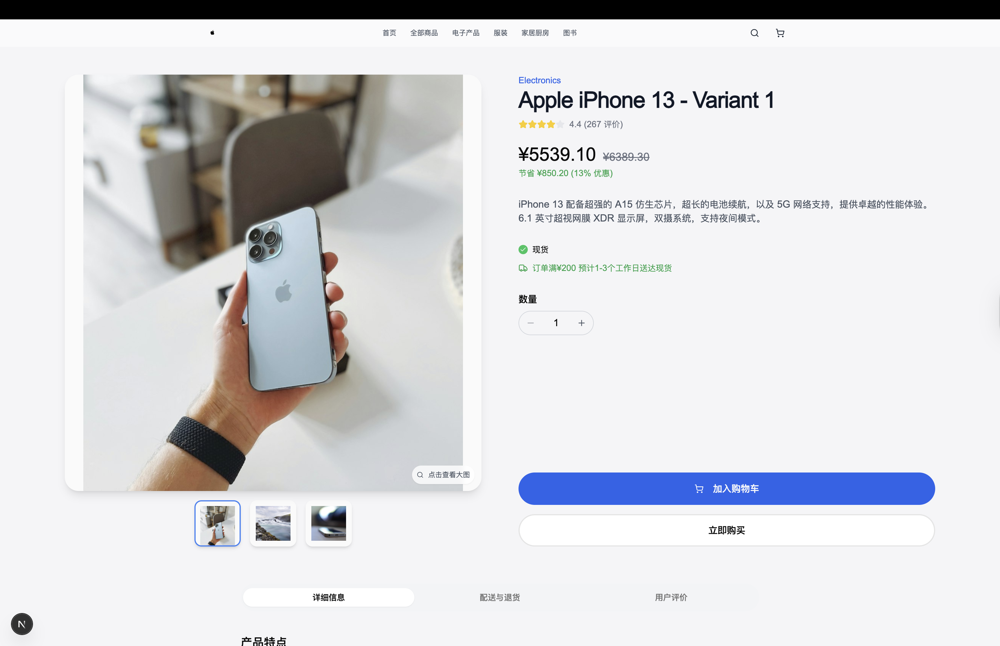
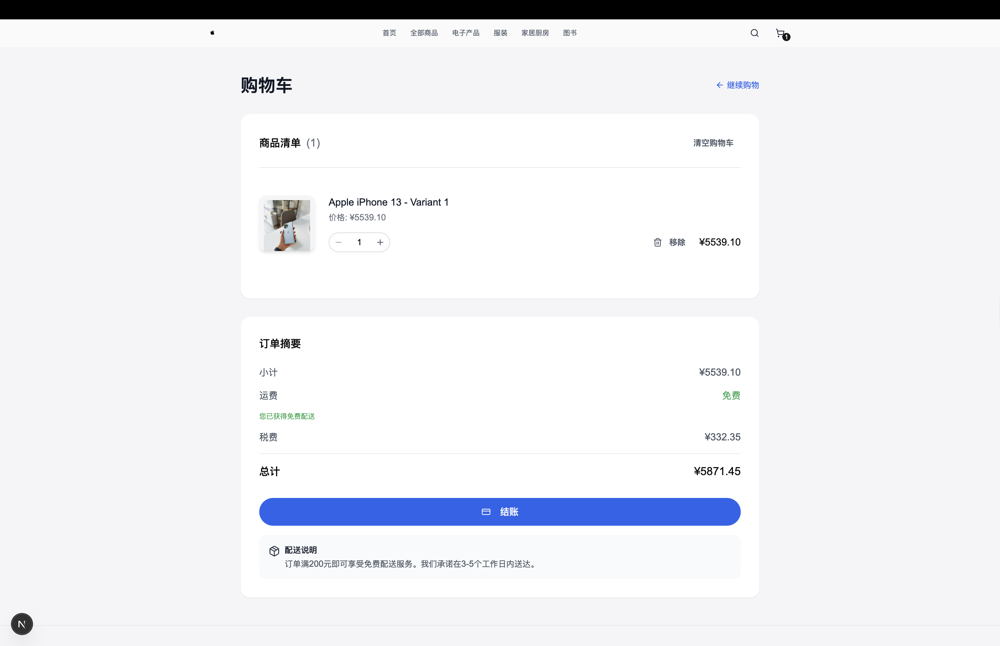
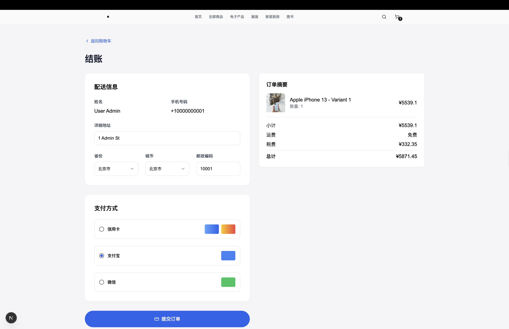
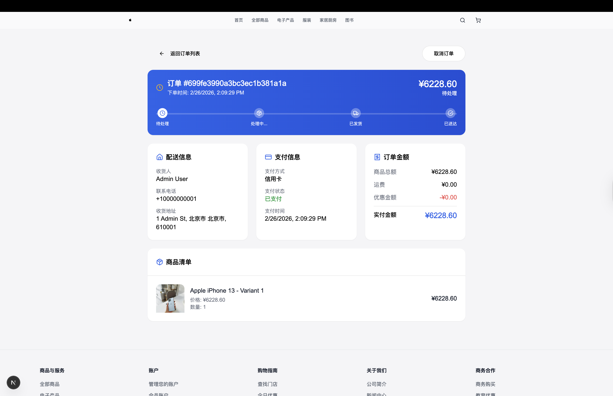

# 🛒 Shopping System Monorepo

Monorepo for a shopping system built with Turborepo and PNPM. It includes web and mobile clients, backend services, and shared packages.

## 📋 Requirements

- Node.js >= 20
- PNPM (see `package.json` `packageManager`)
- MongoDB (for the API service)

## ✨ Features

### 🌐 Web Storefront

- **🏠 Home** – Hero, category showcase, featured products
- **📦 Products** – List, category filter, search, product detail
- **🛒 Cart** – Add/update/remove items
- **💳 Checkout** – Shipping address, payment, order confirmation
- **📋 Orders** – Order list, order detail
- **👤 Account** – Profile, settings
- **🔐 Auth** – Login, register, reset password
- **🌍 i18n** – English, 中文, Español

### ⚙️ API

- **📦 Products** – CRUD, category filter, CSV/JSON import
- **👥 Users** – Register, login, reset password
- **🛒 Cart** – Add, update, remove, clear
- **📋 Orders** – Create, list, status update, cancel
- **💡 Recommendations** – Product-based recommendations

### 👨‍💼 Admin

- **📦 Products** – List, create, delete
- **📋 Orders** – List by status, update status
- **👥 Users** – List
- **📹 Meeting** – WebRTC video, chat, TTS/STT, live subtitles, translation

## 📸 Screenshots

### Web

<p align="center">
  
  
  
  
  
  
  
  
  
</p>

## 🚀 Quick start

Install all dependencies:

```bash
pnpm install
```

Start development (all workspaces):

```bash
pnpm dev
```

Common scoped dev commands:

```bash
pnpm dev:web
pnpm dev:api
pnpm dev:admin
pnpm dev:mobile
pnpm dev:api-web
pnpm dev:meeting-signal
pnpm dev:web:storybook
```

### 🔒 Local HTTPS (development)

For local development with encrypted traffic between browser and web app:

1. Generate a local certificate with `mkcert`:
   - `brew install mkcert nss`
   - `mkcert -install`
   - `mkdir -p ~/certs && cd ~/certs && mkcert localhost 127.0.0.1 ::1`
2. Configure local Nginx (e.g. `/opt/homebrew/etc/nginx/nginx.conf`) with an HTTPS server:

```nginx
server {
    listen 443 ssl;
    server_name localhost;

    ssl_certificate     /Users/<user>/certs/localhost+2.pem;
    ssl_certificate_key /Users/<user>/certs/localhost+2-key.pem;

    location / {
        proxy_pass http://127.0.0.1:3000;
        proxy_set_header Host $host;
        proxy_set_header X-Real-IP $remote_addr;
        proxy_set_header X-Forwarded-For $proxy_add_x_forwarded_for;
        proxy_set_header X-Forwarded-Proto https;
    }
}
```

3. Start the web app with `pnpm dev:web` (Next.js on `http://localhost:3000`) and Nginx, then access the storefront via `https://localhost`.

## 💻 Common commands

```bash
pnpm build
pnpm test
pnpm lint
pnpm lint:fix
pnpm format
pnpm clean
```

🌱 Seed sample data (via `scripts`):

```bash
pnpm seed:api
pnpm seed:orders-users
```

- `seed:api` – products (cleans then seeds ~200 products)
- `seed:orders-users` – users and orders (cleans then seeds; env: `SEED_USER_COUNT`, `SEED_ORDER_COUNT`, `SEED_ORDER_DAYS_SPAN`)

## 📁 Project structure

```
shopping-system/
├── apps/        # user-facing apps (web, mobile, admin, crawler-cli)
├── services/    # backend services (api, crawler, data-mining, meeting-signal)
├── packages/    # shared packages (types, utils, auth, payment, monitoring, ...)
├── docs/        # documentation (api, architecture, development, devops)
├── scripts/     # seed scripts (products, orders, users) and utilities
└── screenshots/ # app screenshots
```

## 📚 Documentation

- API docs: `docs/api/api-documentation.md`
- OpenAPI spec: `docs/api/openapi.json`
- Postman collection: `docs/api/postman_collection.json`
- Architecture diagrams (C4 / TOGAF): `docs/architecture/`
- Environment setup: `docs/development/ENVIRONMENT.md`
- Onboarding: `docs/development/onboarding-guide.md`
- Testing guide: `docs/development/testing-guide.md`

## 🛠️ Services and apps

- **Web app** (`apps/web`): Next.js storefront
- **Mobile app** (`apps/mobile`): Expo + React Native
- **Admin app** (`apps/admin`): Angular admin UI – products, orders, users, analytics (Orders/Products/Users tabs with ECharts and AG Grid), Team Meeting (video, chat, TTS/STT, live subtitles, translation via MyMemory API)
- **API service** (`services/api`): Express + Mongoose; see `services/api/README.md` for env vars
- **Meeting signal** (`services/meeting-signal`): Socket.IO signaling for WebRTC; default port 4100

## 🤝 Contributing

- Create a branch from `main` (e.g. `feat/...`, `fix/...`, `docs/...`)
- Keep changes focused and update docs when behavior changes
- Use Conventional Commits for commit messages

## 📄 License

MIT
