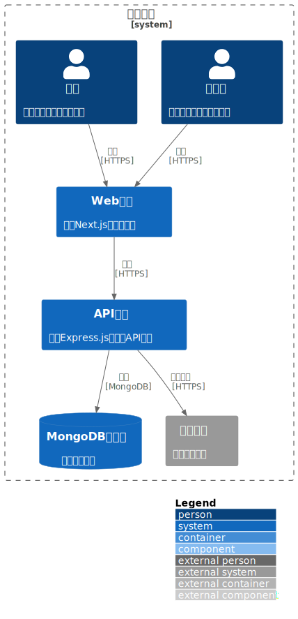
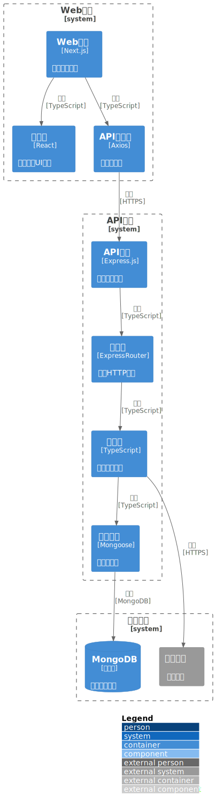
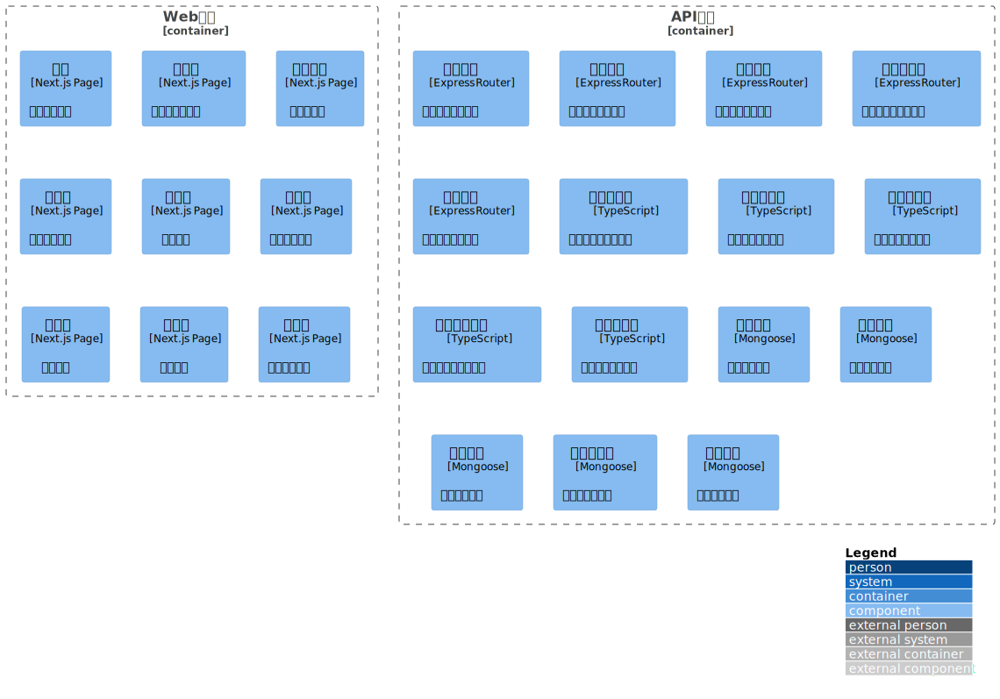

# Shopping System Monorepo

A shopping system monorepo project based on Turborepo, including Web frontend, mobile application, and backend API services.

## Project Structure

```
shopping-system/
├── apps/
│   ├── web/           # Next.js Web frontend application
│   ├── mobile/        # React Native mobile application
│   └── api/           # Express.js backend API service
├── packages/
│   ├── ui/            # UI component library
│   └── shared/        # Shared utilities and types
├── docs/              # Project documentation
│   ├── api/           # API documentation
│   ├── architecture/ # Architecture documentation
│   ├── development/   # Development documentation
│   ├── operations/    # Operations documentation
│   └── project/       # Project documentation
└── scripts/           # Utility scripts
```

## Technology Stack

### Core Frameworks

- [Turborepo](https://turbo.build/repo) - Monorepo build system
- [PNPM](https://pnpm.io/) - Package manager
- [TypeScript](https://www.typescriptlang.org/) - Type system

### Web Frontend

- [Next.js](https://nextjs.org/) - React framework
- [React](https://react.dev/) - UI library
- [Tailwind CSS](https://tailwindcss.com/) - CSS framework
- [Radix UI](https://www.radix-ui.com/) - Unstyled UI components
- [Zustand](https://zustand-demo.pmnd.rs/) - State management
- [React Hook Form](https://react-hook-form.com/) - Form handling
- [i18next](https://www.i18next.com/) - Internationalization
- [PostHog](https://posthog.com/) - Product analytics

### Mobile Application

- [React Native](https://reactnative.dev/) - Cross-platform mobile application framework
- [Expo](https://expo.dev/) - React Native development platform
- [TypeScript](https://www.typescriptlang.org/) - Type system
- [Zustand](https://zustand-demo.pmnd.rs/) - State management
- [Axios](https://axios-http.com/) - HTTP client
- [Expo Router](https://docs.expo.dev/router/introduction/) - File system routing

### Backend API

- [Express.js](https://expressjs.com/) - Node.js web framework
- [MongoDB](https://www.mongodb.com/) - Document database
- [Mongoose](https://mongoosejs.com/) - MongoDB ODM
- [Serverless Framework](https://www.serverless.com/) - Serverless deployment
- [Swagger](https://swagger.io/) - API documentation

### Development Tools

- [Vitest](https://vitest.dev/) - Testing framework
- [Testing Library](https://testing-library.com/) - React component testing utilities
- [Storybook](https://storybook.js.org/) - UI component development environment
- [ESLint](https://eslint.org/) - Code linting
- [Prettier](https://prettier.io/) - Code formatting

### Deployment & Monitoring

- [Vercel](https://vercel.com/) - Web application deployment platform
- [Vercel Analytics](https://vercel.com/docs/analytics) - Analytics tool
- [Vercel Speed Insights](https://vercel.com/docs/speed-insights) - Performance monitoring

## Key Features

### Web Frontend Features

- Responsive design supporting mobile and desktop
- Product category browsing and search
- Shopping cart management
- User registration, login, and account management
- Product detail pages
- Order management and history
- Multi-language support (internationalization)
- Dark mode support
- Payment integration

### Mobile Application Features

- Homepage carousel and recommended products
- Product category browsing and filtering
- Shopping cart management
- User account management
- Order history viewing
- Local data caching
- Responsive UI design

### Backend API Features

- RESTful API endpoints
- User authentication and authorization (JWT)
- Product management (CRUD operations)
- Shopping cart management
- Order processing and status management
- Data validation and error handling
- Swagger API documentation
- Admin permission control

## Project Architecture

### C4-Context



### C4-Container



### C4-Component



### C4-Code


## Database Relationships


## Configuration

### Turborepo Configuration

The project uses Turborepo for build management, with main configuration in the `turbo.json` file:

```json
{
  "$schema": "https://turbo.build/schema.json",
  "globalDependencies": ["**/.env.*local"],
  "remoteCache": {
    "enabled": true
  },
  "pipeline": {
    "build": {
      "dependsOn": ["^build"],
      "outputs": ["dist/**", ".next/**", "!.next/cache/**"]
    },
    "lint": {},
    "dev": {
      "cache": false,
      "persistent": true
    },
    "clean": {
      "cache": false
    },
    "start": {
      "dependsOn": ["build"]
    },
    "test": {
      "dependsOn": ["^build"],
      "outputs": []
    }
  }
}
```

Configuration notes:

- `globalDependencies`: Global dependency files, changes to environment variable files will trigger all tasks to rerun
- `remoteCache`: Enable Turborepo remote cache functionality
- `pipeline.build`: Build command, depends on all upstream package builds completing
- `pipeline.dev`: Development command, cache disabled and set as persistent
- `pipeline.clean`: Clean command, cache disabled
- `pipeline.start`: Start command, depends on build completion
- `pipeline.test`: Test command, depends on build completion

### GitHub Actions Configuration

The project uses GitHub Actions for CI/CD, with configuration file located at `.github/workflows/ci.yml`. Main features:

- Automatically run tests and builds
- Integrate Turborepo remote cache
- PNPM dependency cache optimization

To enable Turborepo remote cache, configure the following environment variables:

1. `TURBO_TOKEN`: Obtain from [Vercel account settings](https://vercel.com/account/tokens)
2. `TURBO_TEAM`: Get team ID from Vercel team settings

### Vercel Deployment Configuration

The project uses Vercel for deployment, with configuration file located at `vercel.json`:

```json
{
  "$schema": "https://openapi.vercel.sh/vercel.json",
  "buildCommand": "pnpm build",
  "devCommand": "pnpm dev",
  "installCommand": "pnpm install",
  "framework": "nextjs"
}
```

## Development Guide

### Environment Requirements

#### General Requirements

- Node.js >= 20.0.0
- PNPM >= 8.0.0
- MongoDB >= 6.0

#### Web Frontend

- Node.js >= 20.0.0
- PNPM >= 8.0.0

#### Mobile Application

- Node.js >= 20.0.0
- PNPM >= 8.0.0
- Expo CLI (install globally via npm/yarn)
- Android Studio / Xcode (for native development, optional)

#### Backend API

- Node.js >= 20.0.0
- MongoDB >= 6.0
- AWS CLI (for Serverless deployment)

### Installing Dependencies

#### Install All Dependencies

```bash
pnpm install
```

#### Install Web Frontend Dependencies Only

```bash
cd apps/web
pnpm install
```

#### Install Mobile Application Dependencies Only

```bash
cd apps/react-native-app
yarn install
# or
pnpm install
```

#### Install Backend API Dependencies Only

```bash
cd apps/api
pnpm install
```

### Development Mode

#### Start All Services

```bash
pnpm dev
```

#### Start Web Frontend Only

```bash
cd apps/web
pnpm dev
# Access at http://localhost:3000
```

#### Start Mobile Application Only

```bash
cd apps/react-native-app
yarn start
# or specify platform
yarn ios      # iOS
yarn android  # Android
yarn web      # Web
```

#### Start Backend API Only

```bash
cd apps/api
pnpm dev
# Access at http://localhost:3001
```

### Building the Project

#### Build All Projects

```bash
pnpm build
```

#### Build Web Frontend

```bash
cd apps/web
pnpm build
```

#### Build Mobile Application

```bash
cd apps/react-native-app
# Build using Expo
expo build:android    # Android APK
expo build:ios      # iOS
expo build:web         # Web
```

#### Build Backend API

```bash
cd apps/api
pnpm build
```

### Running Tests

#### Run All Tests

```bash
pnpm test
```

#### Run Web Frontend Tests

```bash
cd apps/web
pnpm test
pnpm test:watch      # Watch mode
pnpm test:coverage   # Coverage report
```

#### Run Mobile Application Tests

```bash
cd apps/react-native-app
yarn test
yarn test:coverage   # Coverage report
yarn test:watchAll   # Watch mode
```

#### Run Backend API Tests

```bash
cd apps/api
pnpm test
pnpm test:watch      # Watch mode
pnpm test:coverage   # Coverage report
```

### Code Quality Checks

#### Check All Code

```bash
pnpm lint
pnpm lint:fix        # Auto-fix
pnpm format          # Format code
```

#### Check Web Frontend Code

```bash
cd apps/web
pnpm lint
```

#### Check Mobile Application Code

```bash
cd apps/react-native-app
yarn lint
```

#### Check Backend API Code

```bash
cd apps/api
pnpm lint
```

## Testing

The project uses Vitest and Testing Library for testing:

- Component testing: Use Testing Library for React component testing
- API testing: Use Vitest for backend API testing
- Integration testing: Use Vitest for end-to-end testing

Test files are located in the `tests` directory of each package, following these naming conventions:

- Component tests: `*.test.tsx`
- API tests: `*.test.ts`
- Integration tests: `*.integration.test.ts`

## API Documentation

The project provides complete OpenAPI specification documentation and Postman collection:

- [API Documentation](docs/api/api-documentation.md)
- [OpenAPI Specification](docs/api/openapi.json)
- [Postman Collection](docs/api/postman_collection.json)

## Database Initialization

The backend API provides various database seed scripts:

```bash
cd apps/api

# Initialize database with 200 products (development environment)
pnpm seed:products200:dev

# Initialize database with 200 products (test environment)
pnpm seed:products200:test

# Initialize database with 200 products (production environment)
pnpm seed:products200:prod
```

**Note**: Ensure that the corresponding environment variable files (`.env.local`, `.env.test`, or `.env.prod`) are properly configured before running seed scripts.

## System Architecture

Project architecture documentation and diagrams are located in the `docs/architecture/` directory:

### C4 Model

- [C4 Context Diagram](docs/architecture/c4-context.puml) - System context
- [C4 Container Diagram](docs/architecture/c4-container.puml) - Container architecture
- [C4 Component Diagram](docs/architecture/c4-component.puml) - Component architecture
- [C4 Code Diagram](docs/architecture/c4-code.puml) - Code architecture

### TOGAF Architecture

- [Business Architecture](docs/architecture/togaf/business-architecture.puml)
- [Application Architecture](docs/architecture/togaf/application-architecture.puml)
- [Data Architecture](docs/architecture/togaf/data-architecture.puml)
- [Technology Architecture](docs/architecture/togaf/technology-architecture.puml)

## Environment Variable Configuration

### Web Frontend Environment Variables

Create a `.env.local` file in the `apps/web` directory:

```env
# Next.js configuration
NEXTAUTH_SECRET=your_nextauth_secret_here
NEXTAUTH_URL=http://localhost:3000

# API address
NEXT_PUBLIC_API_URL=http://localhost:3001

# PostHog analytics (optional)
NEXT_PUBLIC_POSTHOG_KEY=your_posthog_key
NEXT_PUBLIC_POSTHOG_HOST=https://app.posthog.com
```

### Backend API Environment Variables

Create a `.env.local` file in the `apps/api` directory:

```env
# Database configuration
MONGODB_URI=mongodb://localhost:27017/shopping-system-public

# Server configuration
PORT=3001
NODE_ENV=development

# JWT configuration
JWT_SECRET=your_jwt_secret_here

# CORS configuration
CORS_ORIGINS=http://localhost:3000,http://localhost:8000

# Admin configuration
ADMIN_SECRET=your_admin_secret_here
```

### Mobile Application Environment Variables

Mobile application environment variables are configured in `apps/react-native-app/src/constants/config.ts`. For detailed configuration, please refer to [apps/react-native-app/README.md](apps/react-native-app/README.md).

**Note**:

- All sensitive information (such as keys, passwords) should not be committed to version control
- Production environments should use environment variable management services (such as Vercel, AWS Secrets Manager)
- For detailed environment variable descriptions, please refer to [docs/development/ENVIRONMENT.md](docs/development/ENVIRONMENT.md)

## Project Access Links

- **Web Application**: https://felixzhu.shop
- **API Documentation**: Visit the `/api-docs` endpoint of the backend API to view Swagger documentation
- **Mobile Application**: Install to device after building with Expo or run using the Expo Go app

## Contributing

We welcome all forms of contributions! Please follow these steps:

### Development Workflow

1. **Fork the project** to your GitHub account

2. **Create a new branch from the protected branch**

   ```bash
   git checkout master
   git pull origin master
   git checkout -b feat/your-feature-name
   ```

3. **Develop**

   - Follow project code standards
   - Write necessary tests
   - Update relevant documentation

4. **Commit changes**

   ```bash
   git add .
   git commit -m "feat: add your feature description"
   ```

   - Commit messages should follow [Commit Convention](docs/development/COMMIT_CONVENTION.md)

5. **Push to branch**

   ```bash
   git push origin feat/your-feature-name
   ```

6. **Create Pull Request**
   - Submit to `feature` branch (new features) or `master` branch (other changes)
   - Use the project's PR template
   - Ensure all CI checks pass
   - Wait for Code Review

### Branch Naming Convention

- `feat/xxx` - New feature
- `fix/xxx` - Bug fix
- `docs/xxx` - Documentation update
- `refactor/xxx` - Code refactoring
- `style/xxx` - Style changes
- `test/xxx` - Test related
- `chore/xxx` - Build/tool related

For detailed specifications, please refer to the Git specification document in the project root directory.

### Code Standards

- Use ESLint and Prettier to maintain consistent code style
- Follow TypeScript best practices
- Write clear comments and documentation
- Ensure test coverage

### Documentation

- Update relevant README files
- Update API documentation (if applicable)
- Add changelog entries

For more information, please refer to:

- [Development Guide](docs/development/onboarding-guide.md)
- [Testing Guide](docs/development/testing-guide.md)
- [Commit Convention](docs/development/COMMIT_CONVENTION.md)

## Related Documentation

### Development Documentation

- [Development Guide](docs/development/onboarding-guide.md) - New member onboarding guide
- [Testing Guide](docs/development/testing-guide.md) - Testing related instructions
- [Commit Convention](docs/development/COMMIT_CONVENTION.md) - Git commit convention
- [Version Management](docs/development/VERSIONING.md) - Version number management specification
- [Environment Configuration](docs/development/ENVIRONMENT.md) - Detailed environment variable descriptions

### API Documentation

- [API Documentation](docs/api/api-documentation.md) - Complete API description
- [OpenAPI Specification](docs/api/openapi.json) - OpenAPI 3.0 specification file
- [Postman Collection](docs/api/postman_collection.json) - Postman test collection

### Architecture Documentation

- [Architecture Overview](docs/architecture/) - System architecture related documentation
- [C4 Model](docs/architecture/c4-model.puml) - System architecture model

### Operations Documentation

- [Deployment Guide](docs/development/deployment-guide.md) - Deployment related instructions
- [Operations Manual](docs/operations/operations-manual.md) - Operations manual
- [Change Log](docs/operations/change-log.md) - Version change records

### Project Documentation

- [Documentation Overview](docs/project/documentation-overview.md) - Documentation structure description
- [Glossary](docs/project/glossary.md) - Project terminology definitions

## License

MIT License

## Contact

For questions or suggestions, please contact us through:

- Submit a [GitHub Issue](https://github.com/your-repo/issues)
- Create a Pull Request
- Check project documentation for more information
