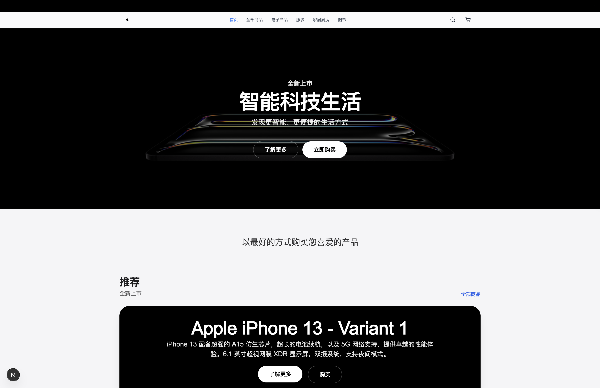
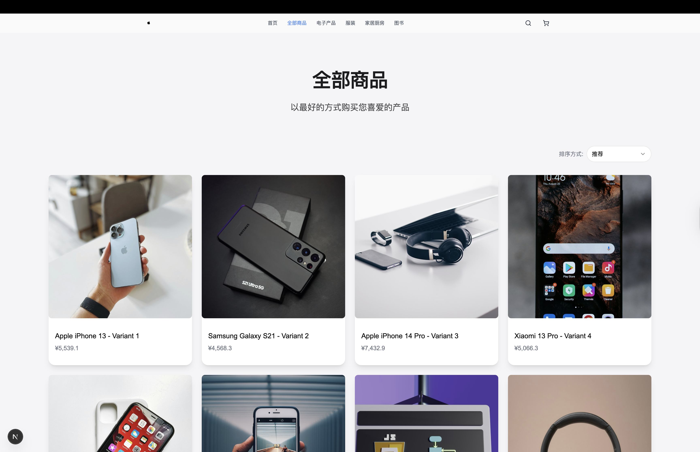
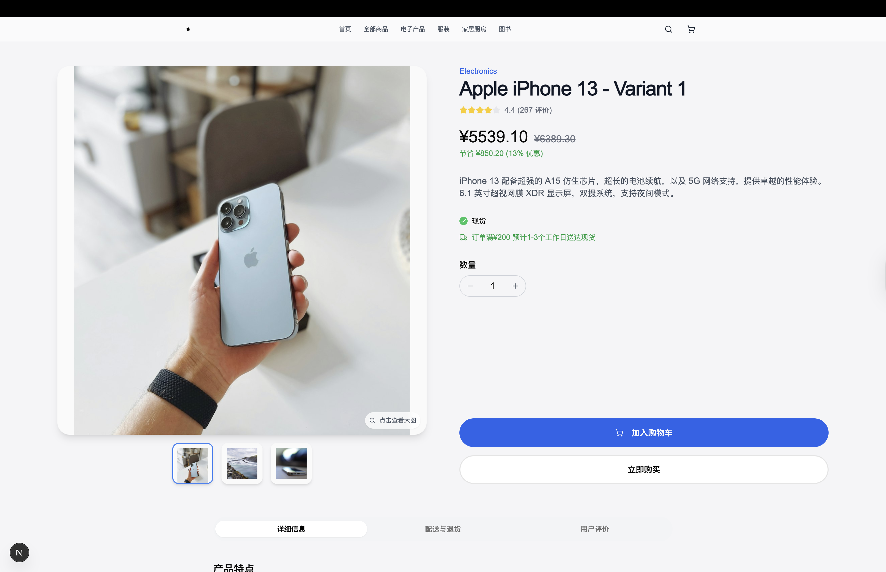
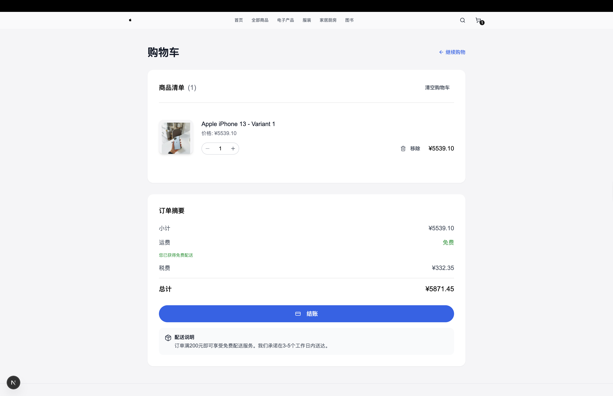
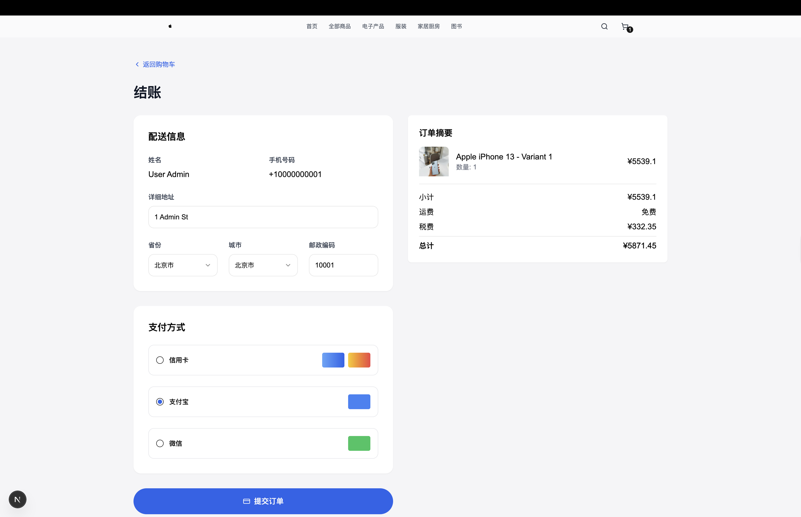
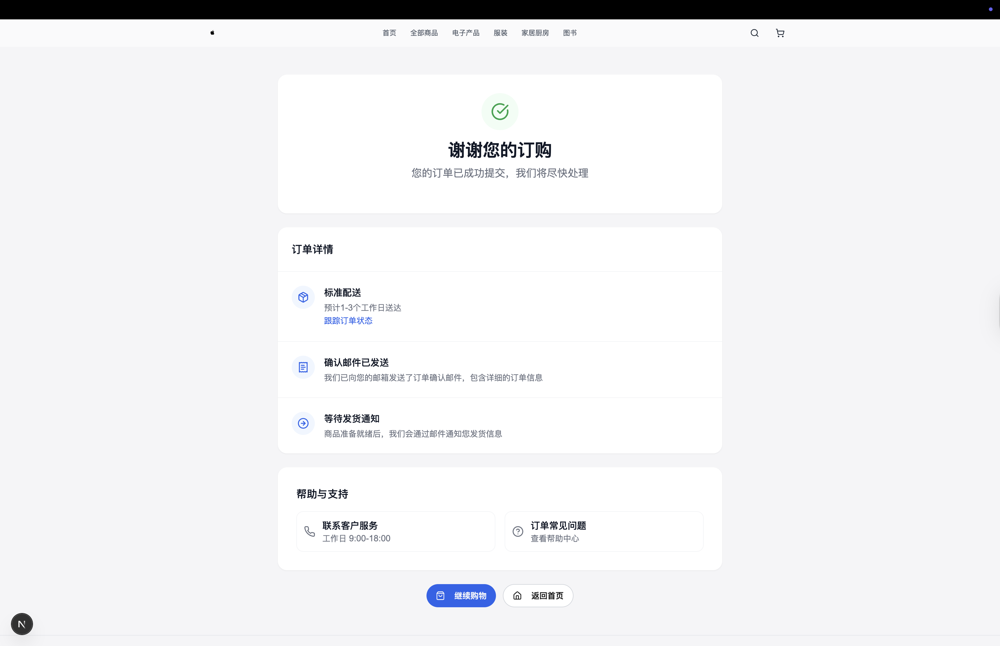
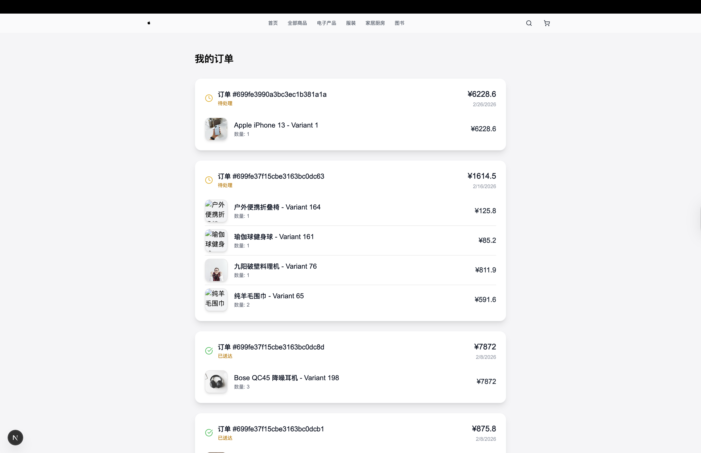
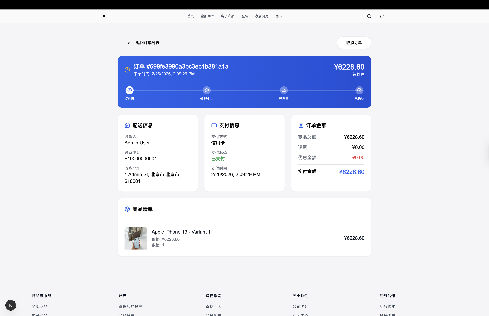

# 购物系统 Monorepo

这是一个功能完善的电商购物系统，支持网页和移动端浏览，提供商品展示、购物车、订单管理、用户登录等功能。系统包含管理后台，支持商品管理、订单处理、数据分析以及团队视频会议。

## 环境要求

- Node.js >= 20
- PNPM（参见 `package.json` 中的 `packageManager`）
- MongoDB（用于 API 服务）

## 功能特性

### 网页商店

- **首页** – 横幅、分类展示、精选商品
- **商品** – 列表、分类筛选、搜索、商品详情
- **购物车** – 添加/更新/删除商品
- **结算** – 收货地址、支付、订单确认
- **订单** – 订单列表、订单详情
- **账户** – 个人资料、设置
- **登录认证** – 登录、注册、忘记密码
- **国际化** – English、中文、Español

### API

- **商品** – 增删改查、分类筛选、CSV/JSON 导入
- **用户** – 注册、登录、忘记密码
- **购物车** – 添加、更新、删除、清空
- **订单** – 创建、列表、状态更新、取消
- **推荐** – 基于商品的推荐

### 管理后台

- **商品** – 列表、创建、删除
- **订单** – 按状态列表、更新状态
- **用户** – 列表
- **视频会议** – WebRTC 视频、聊天、TTS/STT、实时字幕、翻译

## 截图

### 网页端

<p align="center">
  
  
  
  
  
  
  
  
  
</p>

## 快速开始

安装所有依赖：

```bash
pnpm install
```

启动开发环境（所有工作区）：

```bash
pnpm dev
```

常用 scoped 开发命令：

```bash
pnpm dev:web
pnpm dev:api
pnpm dev:admin
pnpm dev:mobile
pnpm dev:api-web
pnpm dev:meeting-signal
pnpm dev:web:storybook
```

### 本地 HTTPS（开发）

用于浏览器和 Web 应用之间的加密流量本地开发：

1. 使用 `mkcert` 生成本地证书：
   - `brew install mkcert nss`
   - `mkcert -install`
   - `mkdir -p ~/certs && cd ~/certs && mkcert localhost 127.0.0.1 ::1`
2. 配置本地 Nginx（例如 `/opt/homebrew/etc/nginx/nginx.conf`）使用 HTTPS 服务器：

```nginx
server {
    listen 443 ssl;
    server_name localhost;

    ssl_certificate     /Users/<user>/certs/localhost+2.pem;
    ssl_certificate_key /Users/<user>/certs/localhost+2-key.pem;

    location / {
        proxy_pass http://127.0.0.1:3000;
        proxy_set_header Host $host;
        proxy_set_header X-Real-IP $remote_addr;
        proxy_set_header X-Forwarded-For $proxy_add_x_forwarded_for;
        proxy_set_header X-Forwarded-Proto https;
    }
}
```

3. 使用 `pnpm dev:web` 启动 Web 应用（Next.js 运行在 `http://localhost:3000`）和 Nginx，然后通过 `https://localhost` 访问商店。

## 常用命令

```bash
pnpm build
pnpm test
pnpm lint
pnpm lint:fix
pnpm format
pnpm clean
```

导入示例数据（通过 `scripts`）：

```bash
pnpm seed:api
pnpm seed:orders-users
```

- `seed:api` – 商品（先清空后导入约 200 个商品）
- `seed:orders-users` – 用户和订单（先清空后导入；环境变量：`SEED_USER_COUNT`、`SEED_ORDER_COUNT`、`SEED_ORDER_DAYS_SPAN`）

## 项目结构

```
shopping-system/
├── apps/        # 用户端应用（web、mobile、admin、crawler-cli）
├── services/    # 后端服务（api、crawler、data-mining、meeting-signal）
├── packages/    # 共享包（types、utils、auth、payment、monitoring 等）
├── docs/        # 文档（api、architecture、development、devops）
├── scripts/     # 导入脚本（商品、订单、用户）和工具
└── screenshots/ # 应用截图
```

## 文档

- API 文档：`docs/api/api-documentation.md`
- OpenAPI 规范：`docs/api/openapi.json`
- Postman 集合：`docs/api/postman_collection.json`
- 架构图（C4 / TOGAF）：`docs/architecture/`
- 环境配置：`docs/development/ENVIRONMENT.md`
- 新人指南：`docs/development/onboarding-guide.md`
- 测试指南：`docs/development/testing-guide.md`

## 服务和应用

- **网页应用**（`apps/web`）：Next.js 商店
- **移动应用**（`apps/mobile`）：Expo + React Native
- **管理后台**（`apps/admin`）：Angular 管理界面 – 商品、订单、用户、数据分析（订单/商品/用户标签页，包含 ECharts 和 AG Grid）、团队会议（视频、聊天、TTS/STT、实时字幕、通过 MyMemory API 翻译）
- **API 服务**（`services/api`）：Express + Mongoose；环境变量参见 `services/api/README.md`
- **会议信令服务**（`services/meeting-signal`）：Socket.IO WebRTC 信令；默认端口 4100

## 贡献指南

- 从 `main` 创建分支（例如 `feat/...`、`fix/...`、`docs/...`）
- 保持改动聚焦，行为变更时更新文档
- 使用 Conventional Commits 规范编写提交信息

## 开源协议

MIT
