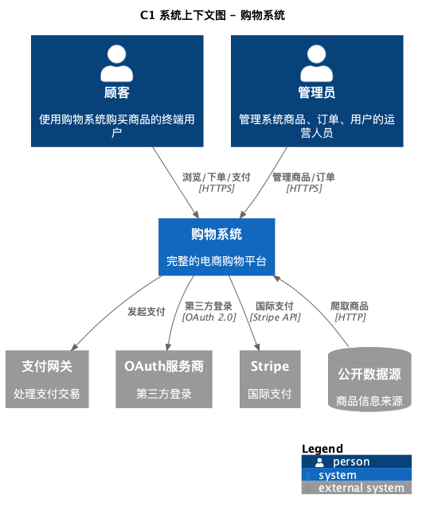
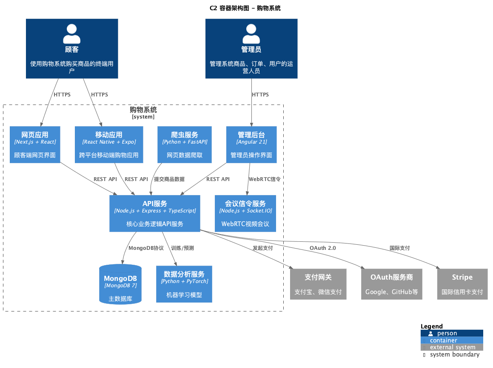
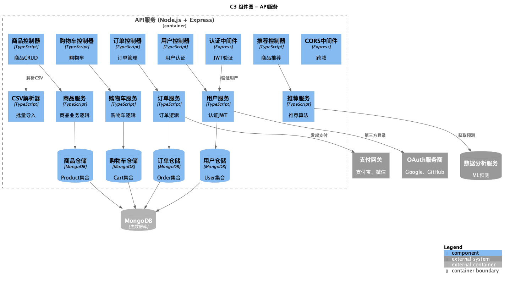
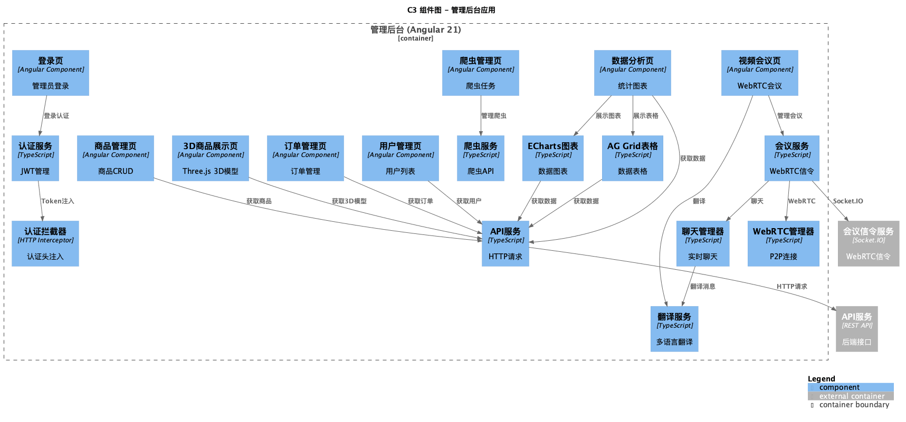
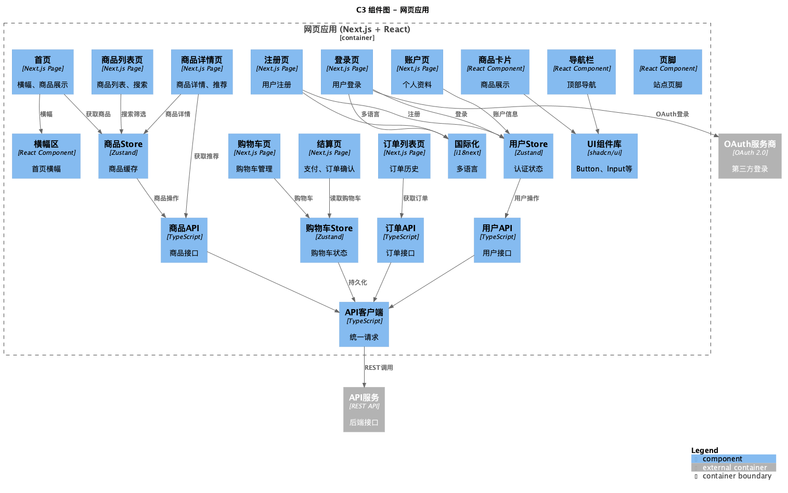

# Architecture

本目录包含购物系统的架构文档和 PlantUML 图表。

## 目录结构

```
architecture/
├── c4/
│   ├── C1_System_Context.puml      # C1 系统上下文图
│   ├── C2_Container.puml          # C2 容器图
│   ├── C3_Component_API.puml      # C3 组件图 - API服务
│   ├── C3_Component_Admin.puml    # C3 组件图 - 管理后台
│   └── C3_Component_Web.puml      # C3 组件图 - 网页应用
├── togaf/                           # TOGAF 架构视图
│   ├── business-architecture.puml
│   ├── application-architecture.puml
│   ├── data-architecture.puml
│   └── technology-architecture.puml
├── wardley-map.puml                 # 沃德利地图 (英文)
├── wardley-map-cn.puml             # 沃德利地图 (中文)
└── zero-trust-architecture.puml   # 零信任架构
```

## C4 模型

C4 模型是一种可视化架构文档的方法，从不同抽象层次描述软件系统：

### C1 系统上下文图

展示系统与外部参与者（用户、其他系统）的关系。



**文件**: `c4/C1_System_Context.puml`

### C2 容器图

展示系统内部的技术容器（应用、服务、数据库）。



**文件**: `c4/C2_Container.puml`

| 容器 | 技术栈 | 职责 |
|------|--------|------|
| 网页应用 | Next.js + React | 顾客端界面 |
| 移动应用 | React Native + Expo | 跨平台移动购物 |
| 管理后台 | Angular 21 | 运营管理、视频会议 |
| API服务 | Node.js + Express + TypeScript | 核心业务逻辑 |
| MongoDB | MongoDB 7 | 主数据库 |
| 爬虫服务 | Python + FastAPI | 网页数据爬取 |
| 数据分析服务 | Python + PyTorch | ML模型训练 |
| 会议信令服务 | Node.js + Socket.IO | WebRTC信令 |

### C3 组件图

展示每个容器的内部组件结构。

**API服务** - 

**管理后台** - 

**网页应用** - 

## 沃德利地图

展示技术演化和业务价值定位。

**文件**:
- `wardley-map.puml` - 英文版
- `wardley-map-cn.puml` - 中文版

**地图分区**:
| 区域 | 特点 | 组件示例 |
|------|------|----------|
| 创世区 (Genesis) | 创新驱动 | 个性化体验、购买倾向模型、推荐模型 |
| 定制区 (Custom-built) | 差异化核心 | 领域服务、API服务、爬虫服务 |
| 产品区 (Product) | 成熟稳定 | Next.js、MongoDB、Datadog |
| 商品区 (Commodity) | 通用易获取 | Node.js、TypeScript、CDN |

## TOGAF 架构视图

- `togaf/business-architecture.puml` - 业务能力（商品、订单、用户、购物车、支付、爬虫、分析、会议）
- `togaf/application-architecture.puml` - 应用架构（网页、管理后台、API服务、爬虫、会议信令）
- `togaf/data-architecture.puml` - 数据架构（User、Product、Order、Cart实体，MongoDB集合）
- `togaf/technology-architecture.puml` - 技术架构（Angular、ECharts、AG Grid、WebRTC、Socket.IO等）

## 查看图表

所有 `.puml` 文件可通过以下方式渲染：

- VS Code 安装 PlantUML 插件
- PlantUML 服务器
- 本地 PlantUML CLI

```bash
# 安装 PlantUML (macOS)
brew install plantuml

# 生成 PNG
plantuml -Tpng diagram.puml

# 生成 SVG
plantuml -Tsvg diagram.puml
```

## 技术栈概览

### 前端
- **网页**: Next.js 15, React 19, Tailwind CSS, Zustand, shadcn/ui
- **移动**: React Native, Expo
- **管理后台**: Angular 21, Bootstrap 5, ECharts, AG Grid, Three.js

### 后端
- **API服务**: Node.js, Express, TypeScript, Mongoose
- **爬虫服务**: Python, FastAPI, BeautifulSoup, httpx
- **数据分析**: Python, PyTorch, scikit-learn
- **会议信令**: Node.js, Socket.IO

### 基础设施
- **数据库**: MongoDB 7
- **部署**: AWS Lambda, Vercel, Serverless Framework
- **监控**: Datadog APM/RUM
- **CI/CD**: GitHub Actions
