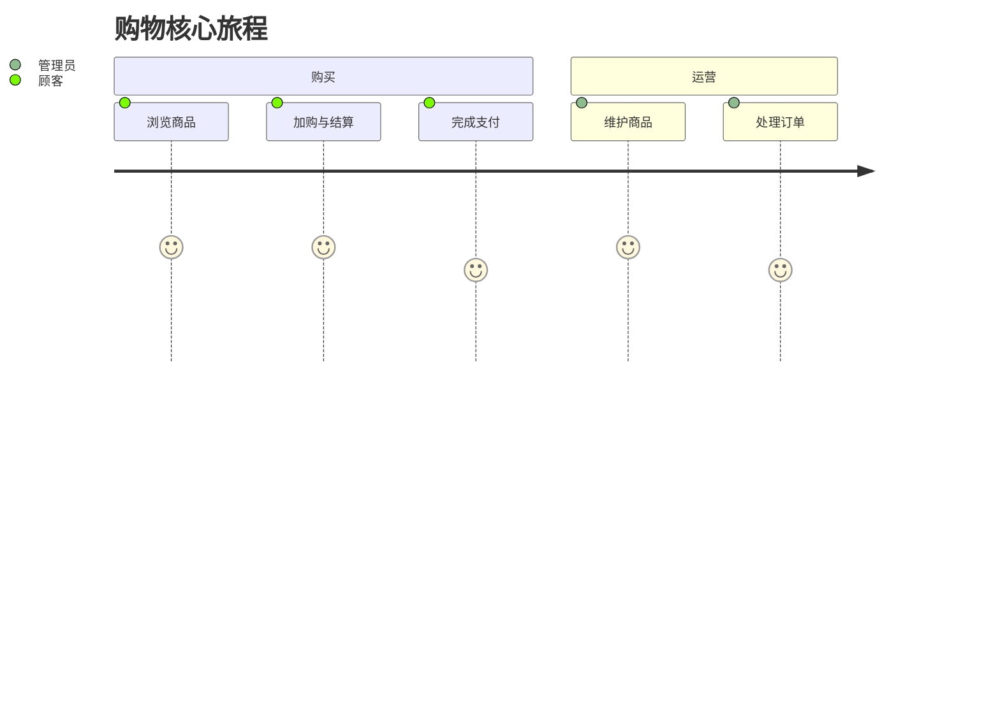

# 用户故事地图

> 格式：Jeff Patton 故事地图 + Mermaid journey + GWT（Epic 分文件）。  
> 故事正文与验收标准见 [user-stories/](./user-stories/)；本页只做索引，避免双源。

## 用户画像

| 角色 | 说明 |
|------|------|
| 顾客 | 浏览商品、下单与支付 |
| 管理员 | 管理商品、订单与用户 |

## 旅程总览

## Backbone 故事地图

### 规划中 / 文档对齐

| 店面 | 订单支付 | 管理 |
|------|----------|------|
| [US-01](./user-stories/E1-storefront.md#us-01-浏览与加购) 浏览与加购 | [US-02](./user-stories/E2-checkout.md#us-02-下单与支付) 下单与支付 | [US-03](./user-stories/E3-admin.md#us-03-后台运营) 后台运营 |

## Epic 索引

| Epic | 文件 | 故事 | 状态 |
|------|------|------|------|
| E1 店面 | [E1-storefront.md](./user-stories/E1-storefront.md) | US-01 | 规划中 |
| E2 结账 | [E2-checkout.md](./user-stories/E2-checkout.md) | US-02 | 规划中 |
| E3 管理 | [E3-admin.md](./user-stories/E3-admin.md) | US-03 | 规划中 |

## 参考

- [User Story Mapping — Jeff Patton](https://www.jpattonassociates.com/user-story-mapping/)
- [Domain Glossary](../Glossary.md)
